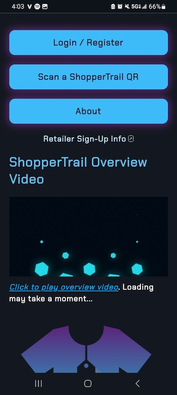

# ShopperTrail UAT Test Cases

Thanks for helping us test ShopperTrail!

Below is a prioritized instructions list of end‑to‑end test scenarios for UAT which runs in a staging environment (non-permanent data).  Each tester should spend ~30–45 minutes working through core flows (Steps 1–4), then—time permitting—move on to guest accounts and QR‑code manipulation (Steps 5–8).

---

## ShopperTrail Quick Overview

ShopperTrail is a data platform for local brick-and-mortar retail businesses. Store customers provide feedback as to why they walked out without buying an item (i.e. wrong size/brand), OR if an item was purchased, feedback as to how satisfied they were.  

There is no purchase necessary. In exchange for this feedback (or "Trail Drops"), users are granted points that can be spent in any ShopperTrail partner store on discounts/rewards.  

Stores using ShopperTrail obtain on-demand direct *private* feedback from customers. Providing critical insights from shoppers in-store which can be used for merchandising and inventory management decisions. 

---

## Prerequisites

- A desktop/laptop and a mobile device in the same room.  
- A printed or on‑screen **Store QR Code** for the test store (provided in this doc).  
- Test user credentials (seeded in staging):  
  - Username: `customer_user2`  
  - Password: `HelloWorldForever!1`  
- Optional: Google or Twitter account for social‑login. 
    - **NOTE** Staging data is deleted *frequently* your email / social sign-in credentials will **NEVER** be shared. 
- Access to your email on your mobile or desktop (confirm registration / guest‑QR emails).

---

## Instructions

Perform the actions in the below test scenarios and record your results. One Scenario ID = one row in the <a href="https://docs.google.com/spreadsheets/d/1IySh1x6vaiKN3oshc-UBUz5yDCohQTiPNfdR_DzeB7U/edit?usp=sharing" target="_blank" rel="noopener">Google Sheets document</a> which you can fill out as you go. Scenario IDs 1 - 8 correspond to the list below below. 

---

## ID 1. Homepage Load & Visual Check

1. **Scenario ID 1:** Navigate to `https://staging.shoppertrail.com`  
2. **Verify:**  
   - Branding (logo, fonts, colors) matches the provided screenshots.

   

   

   - Main video loads and plays on click.  
   - All primary navigation links (Home, About, Account, etc.) are clickable and lead to the correct pages.  
3. **Expected:** Page renders cleanly in < 2 s, video playback starts without error, links navigate correctly.

---

## ID 2. About Page Content & Media

1. **Scenario ID 2:** Click **About** in the main menu.  
2. **Verify:**  
   - Two sections (“For Stores” and “For Customers”) display appropriate heading and text.  
   - At least one video thumbnail (with camcorder emoji) plays on click.  
3. **Expected:** Content is present and legible; video playback initiates on tap/click.

---

## ID 3. Login/Logout (Seeded Account)

1. **Scenario ID 3:** Navigate to **Account > Login**, enter seeded credentials.  
2. **Verify:**  
   - Successful login redirects to the dashboard.  
   - **Account > Logout** correctly ends the session and returns you to the homepage.  
3. **Expected:** Login/logout flows work without error.

---

## ID 4. Social Single Sign‑On (Google / Twitter)

1. **Scenario ID 4:** On the **Login** page, choose **Sign in with Google** or **Sign in with Twitter**.  
2. **Verify:**  
   - OAuth popup works and allows you to complete authentication.  
   - A new ShopperTrail account is created (check in **Account > Profile**).  
   - You can log out and log back in via the same social button.  
3. **Expected:** Social login completes, account is created, and session persists.

---

## ID 5. Trail Drop as Guest

1. **Scenario ID 5:**  
   - On your mobile device, open the camera (or our QR‑scanner app) and scan the **Store QR Code**.  
   - When the “Trail Drop” form appears, choose “Did Not Purchase” and select a reason.  
   - Submit the form.  
2. **Verify:**  
   - A confirmation message appears (“Thank you!”).  
   - No account is required.  
3. **Repeat:** Scan again, choose “Did Purchase,” rate satisfaction, enter item name. Submit.  
4. **Expected:** Both submissions succeed, guest QR redemption code is displayed or emailed.

---

## ID 6. Trail Drop as Registered User

1. **Scenario ID 6:** Log in with your ShopperTrail user.  
2. **Step:** Scan the **Store QR Code** and submit a Trail Drop (purchase or no‑purchase).  
3. **Verify:**  
   - Submission is recorded to your account (check **Dashboard > My Activity**).  
4. **Expected:** Form loads, submission is tied to your user profile.

---

## ID 7. New‑User Registration & Trail Drop

1. **Scenario ID 7:** From the homepage, click **Sign Up**, fill out username/password/email, then log in.  
2. **Step:** Scan the **Store QR Code**, submit a Trail Drop.  
3. **Verify:**  
   - Account creation email (if any) arrives.  
   - After email activation (if required), you can log in.  
   - Trail Drop submission appears under **My Activity**.  
4. **Expected:** Flow “Sign Up → Activate → Submit” completes end‑to‑end.

---

## ID 8. Guest‑QR Redemption to Registered Account

1. **Scenario ID 8:** On your mobile, scan one of the **Guest QR Codes** generated in Step 5.  
2. **Verify:**  
   - You’re prompted to log in (if not already).  
   - Upon login, points from the guest code are credited to your account balance.  
   - Attempting to redeem the same guest code again should be disallowed.  
3. **Expected:** Points credit succeeds once, further attempts yield an error message.

---

## Notes & Next Steps

- **Priority 1:** Steps 1–4 (core site flow, login, content, social SSO).  
- **Priority 2:** Steps 5–6 (guest & registered Trail Drops).  
- **Priority 3:** Steps 7–8 (new sign‑up + guest QR redemption).  
- After completing these, please capture any screenshots, error messages, or suggestions; note the device/browser used.
- If you discover missing data (e.g. no subscription tiers displayed), record the exact page URL and console/network errors.

Happy testing! 🎉 
