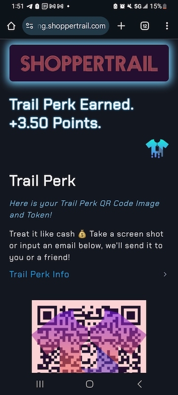
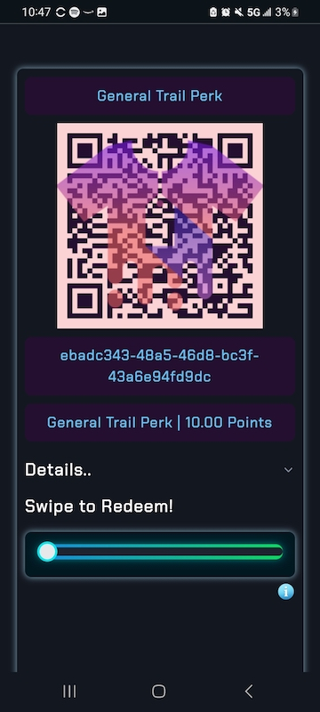
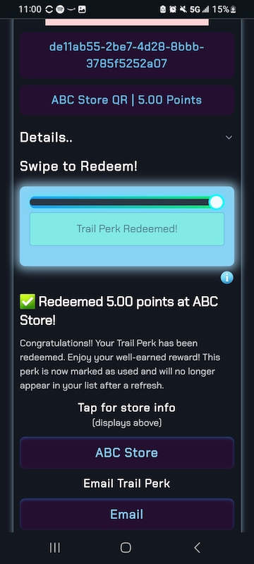

# ShopperTrail UAT

Thanks for helping us test ShopperTrail!

Below is a prioritized instructions list of end‑to‑end test scenarios for UAT which runs in a staging environment (non-permanent data).  Each tester should spend ~30 minutes working through core flows (Steps 1–4), then—time permitting—move on to guest accounts and QR‑code manipulation (Steps 5–10). Testing and documentation should take about an hour. 

Email `shoppertrail@gmail.com` or `service@shoppertrail.com` if you have questions regarding these instructions.  

**Note:** While the steps below cover our core flows, please feel free to deviate and explore the app to assess its intuitiveness.

---

## Table of Contents

1. [Quick Overview](#shoppertrail-quick-overview)  
2. [Prerequisites](#prerequisites)  
3. [Instructions](#instructions)  
   1. [UAT-Data Google Sheet Link](#uat-data-google-sheet-link)
   2. [UAT-Data Google Sheet Example](#uat-data-google-sheet-example)
   3. [Screenshots](#screenshots)
4. [Scenario ID List](#scenario-id-list)  
   1. [ID 1: Homepage Load & Visual Check](#id-1-homepage-load--visual-check)  
   2. [ID 2: About Page Content & Media](#id-2-about-shoppertrail-page-content--media)  
   3. [ID 3: Login & Logout (Seeded Account)](#id-3-login--logout-seeded-account)
   4. [ID 4: Social Single Sign-On (Google & Twitter)](#id-4-social-single-signon-google--twitter)
   5. [ID 5: Trail Drop as Guest](#id-5-trail-drop-as-guest)  
   6. [ID 6: Trail Drop as Registered User](#id-6-trail-drop-as-registered-user)  
   7. [ID 7: New User Registration & Trail Drop](#id-7-new-user-registration--trail-drop)  
   8. [ID 8: Transfer Guest Trail Perk](#id-8-transfer-guest-trail-perk)  
   9. [ID 9: User Generated Trail Perk](#id-9-user-generated-trail-perk)  
   10. [ID 10: Redeem Trail Perk](#id-10-redeem-trail-perk)  

---

## ShopperTrail Quick Overview

ShopperTrail is a data platform for local brick-and-mortar retail businesses. Store customers provide feedback as to why they walked out without buying an item (i.e. wrong size/brand), OR if an item was purchased, feedback as to how satisfied they were.  

There is no purchase necessary. In exchange for this feedback ("Trail Drops" in the ShopperTrail world), users are granted points that can be spent in *any* ShopperTrail partner store on discounts/rewards.  

Stores using ShopperTrail obtain on-demand direct *private* feedback from customers. ShopperTrail is a feedback platform providing critical insights from in-store shoppers which can be used for merchandising and inventory management decisions. 

ShopperTrail (brief) informational landing page: <a href="https://shoppertrail.com" target="_blank" rel="noopener"><i>ShopperTrail</i></a>

---

## Prerequisites

- A desktop/laptop and a mobile device in the same room.  
  - So that you can reference / scan QR codes 
- A printed or on‑screen **Store QR Code** for the test store (provided in this doc).  
- Test user credentials (seeded in staging) i.e.:  
  - Username: `customer_user2`  
  - Password: `HelloWorldForever!1`  
- Optional: Google or Twitter account for social‑login. 
    - **NOTE** Staging data is deleted *frequently!* <mark>Your email / social sign-in credentials will **NEVER** be shared.</mark>
- Access to your email on your mobile or desktop, to confirm registration / guest‑QR emails.

---

## Instructions

Perform the actions in the below test scenarios from the **Scenario ID List.** Record your results in the Google Sheets "UAT-Data" document, one **Scenario ID** should equal **One Row**. Each row should at least contain values for the following columns:  

**Tester Name**, **Scenario ID**, **Scenario Description**, **Pass/Fail**, **Main Comments**, **Device Type**, **Browser**.  

### UAT-Data Google Sheet Link

<a href="https://docs.google.com/spreadsheets/d/1IySh1x6vaiKN3oshc-UBUz5yDCohQTiPNfdR_DzeB7U/edit?usp=sharing" target="_blank" rel="noopener">Google Sheets "UAT-Data" Document Link</a> 

### UAT-Data Google Sheet Example

Example of completing the UAT-Data Google Sheet. This just gives you an idea, there are a few more columns to complete. (GitHub only allows embedded gifs, not videos).

  <!-- Figure with GIF -->
  <figure style="margin:0; text-align:center;">
    
    <figcaption style="font-size:0.9em; color:#555; margin-top:0.5rem;">
      Select your test case from the “Scenario ID” dropdown. These correspond to the <strong>Scenario ID List</strong> below.
    </figcaption>
  </figure>

### Screenshots

Screenshots are appreciated so that we can understand what you are or are not seeing on your particular device/browser. Do colors/fonts seem off? Is the ShopperTrail copy not clear? Did you encounter an error?  
  - Upload screenshots to **UAT Screenshots** folder:  
      <a href="https://drive.google.com/drive/folders/1IzFfxT1jxnsi00PgxqbIxyPiDnhVURZw?usp=sharing" target="_blank" rel="noopener">UAT Screenshots</a> 
  - Once uploaded hover over the screenshot and click the share icon.
  - Make sure "Anyone with the link" is selected under "General Access." 
  - Click "Copy link." 
  - Paste the screenshot link into the appropriate Scenario ID row you're testing in the "UAT-Data" Google Sheet.

---

## Scenario ID List  

### ID 1. Homepage Load & Visual Check

<strong>Expand / Collapse</strong>
 

&ensp;&ensp;**Estimated duration:** <mark>~4 minutes</mark>  

1. **Scenario ID 1:** Navigate to `https://staging.shoppertrail.com`  
2. **Verify:**
   - Branding (logo, fonts, colors) matches the provided screenshots.
   - Note any visual inconsistencies (this is helpful note during all test scenario IDs).
   - Homepage TOP - Main page - logo should fade in/out, in front of a background image.  

     
   
   - Homepage scrolled down - Main page as user scrolls - Should have buttons:
     1. Login / Register
     2. Scan a ShopperTrail QR
     3. About
   - Should include a link for retailer sign-up info (for "Store" users).
   - Should include ShopperTrail Overview Video.  

   

   - Main video loads and plays (click cover gif or link), no need to watch entire video. Loading timer emoji displays with font (if video loads fast you might not see this).
   - Clicking the ShopperTrail small T-Shirt logo will always return to the main homepage, or if the user's logged in, a T-Shirt logo click goes to user's dashboard.
   - All primary navigation links (Login/Register, Scan a ShopperTrail QR, About) are clickable and lead to the correct pages. Note, Login/Register replaces the page graphics with all auth buttons.
   - On your phone, click the *Scan a ShopperTrail QR* there should be options to show "quick" or "advanced" scanner.
     - Click to show quick scanner and grant browser camera permissions. Ensure ShopperTrail scanner pops up. Hide scanner and exit for now.
3. **Expected:** Page renders cleanly in less than 2 seconds, video playback starts without error, links navigate correctly. ShopperTrail scanner appears.
   - *Note* ShopperTrail scanner will only scan ShopperTrail QR Codes, this is so people can't create fakes.
   - Try to scan a random QR code on the internet if you'd like, this should not work. 

---

### ID 2. About ShopperTrail Page Content & Media

<strong>Expand / Collapse</strong>
 

&ensp;&ensp;**Estimated duration:** <mark>~3.5 minutes</mark>  

1. **Scenario ID 2:** Click **About** in the main menu.  
2. **Verify:**  
   - Modal (pop up box) shows informing the user that all information is in one place.
   - Now navigate *back* to the homepage and again *navigate to* the **About** page. The modal should *no longer appear.*
   - Two main sections are available “For Customers” and “For Store Partners.”
     - Clicking one main section should change the table of contents to reflect the proper section.
   - Click and scroll through a few sub-sections of the table of contents to make sure there are no glitches. No need to read everything.
   - Click a sub-section with a video thumbnail (camcorder emoji). Ensure video plays on click. No need to view the whole video.
3. **Expected:** Content is present and legible for the associated **About** page sections; video playback initiates on tap/click.

---

### ID 3. Login & Logout (Seeded Account)

<strong>Expand / Collapse</strong>
 

&ensp;&ensp;**Estimated duration:** <mark>~4.75 minutes</mark>  

1. **Scenario ID 3:** Navigate to **Login / Register**, enter pre-seeded credentials.  
   - Username: `customer_user2`  
   - Password: `HelloWorldForever!1`  
2. Using the top menu Click "Account" > "Edit Profile" and change values of `How often do you shop in stores?` or `Zip` to a new selection or value.
   - *Please DO NOT* change username or email.
   - *Please DO NOT* delete account or change password.
3. On the main user dashboard click "My Stores and Points" towards the bottom, click "ABC Store." 
4. **Verify:**  
   - Successful login redirects to the user dashboard. Note, clicking the t-shirt logo brings you back to the dashboard now (since you are logged into an account).
   - There should be at least 5 points in this account. Note "Locked-in Points" are points that have been used to generate a "Trail Perk" they are ready to be redeemed.
   - Account changes took place (step 2), verify this by clicking "Edit Profile" again.
   - Verify the details for "ABC Store" come up when clicked (step 3).
   - "Account "> "Logout" correctly ends the session and shows a logout page. Click back to the homepage by clicking the T-Shirt logo.  
5. **Expected:** Login/logout and basic dashboard and store info render properly. "Account" > "Edit Profile" flow works.  

---

### ID 4. Social Single Sign‑On (Google & Twitter)

<strong>Expand / Collapse</strong>

&ensp;&ensp;**Estimated duration:** <mark>~5.75 minutes</mark>  

1. **Scenario ID 4:** Navigate to **Login / Register**, choose **Google Sign-in** or **X-Twitter Sign-in**.
   - If you are already logged in with Google or X/Twitter in your browser, you may not need to verify your social account.
   - Reminder:
     - Your single sign-on email is *not* retained, it is in a `staging` environment where data gets deleted frequently.
     - You are also <mark>free to delete your account manually at anytime</mark> via "Account" > "Delete Account."
     - If you don't have a Google or X/Twitter account or if you prefer not to do this **Scenario ID 4**, feel free to skip.
2. Since single sign-on is used, ShopperTrail asks 2 additional questions to register a user profile.
   - How frequently you shop in physical stores
   - Your zip code
3. Once logged in, click "Account" > "Edit Profile" change your `username` or `How often do you shop in stores?` or `Zip`.
4. Once logged in, click "Account" > "Edit Profile" change your email *if you have another email address you can access to verify.*
5. **Verify:**  
    - After click of Google or X/Twitter sign-on, verify OAuth popup from that service provider works and allows you to complete authentication, if you're not already logged in (step 1).
    - After answering (step 2) questions, verify that you are signed in to ShopperTrail by clicking on the *ShopperTrail app dashboard* link. You can also click the t-shirt logo.
      - You should see a message that indicates your username and that it can be changed if you wish.
      - You should see a pop-up that says something like "As a member, you increased your Trail Drop submission limit..." 
        - Log out and log-in a few times, verify that this pop-up no longer appears. 
    - Verify (step 3) took place by clicking again "Account" > "Edit Profile."
    - Verify (step 4) *if you completed this.* Log-in again with single sign-on and check "Account" > "Edit Profile" your new email should be listed.
6. **Expected:** Social login completes successfully, account is created, and session persists. 
   - Delete your account if you wish ("Account" > "Delete Account"). You can re-test this Scenario ID 4 if you'd like. 

---

### ID 5. Trail Drop as Guest

<strong>Expand / Collapse</strong>

&ensp;&ensp;**Estimated duration:** <mark>~6.25 minutes</mark>  

1. **Scenario ID 5:**  This scenario tests the core ShopperTrail feedback feature for *Guests.*  

    Leaving feedback (called a "Trail Drop") for a store, typically constitutes why a shopper left without buying an item (wrong style/brand). Although feedback can also be that they were *happy* to find/purchase an item in-stock. Providing feedback as a guest does not require a ShopperTrail account. 
   - Make sure you are logged out of ShopperTrail. Now, on your mobile device, open the camera (or the ShopperTrail QR‑scanner) and scan the **Store QR Code** below. Note, in the real world this may be at the store's counter or posted inside the door. The below code is a fictional store. 
   

      
   

   <strong>Click “Trail Drop Form”</strong> to begin filling out the form. Which should look like the below.
   
     
   
   Simply invent a scenario where you did not (or did) find what you were looking for, and why you did not make a purchase (or, if you did purchase, how satisfied were you). After the form is submitted, you should arrive at the Trail Perk screen (below) this tells you of your earned points. 
   
     
   
   Add an email address to which to send your earned points - Trail Perk QR code.
2. **Verify:**  
   - A confirmation screen appears. You've just earned ShopperTrail points without having an account. The points are in the QR Code. 
   - Check that the copy makes sense, you can copy / save the token, take a screenshot, or email your QR code to yourself (or anywhere). 
   - Detailed Guest Guide is available on this screen too as a refresher of the process. 
   - No account is required to gain points.  
   - Check email, ShopperTrail Trail Perk should have arrived in your inbox (spam/updates/promotions)
3. **Repeat:** Scan again, choose another scenario, if you did not make a purchase last time maybe you select that you did make a purchase this time. Rate satisfaction, etc. Submit.  
4. **Expected:** Both submissions succeed, Trail Perk Earned screen is displayed, Trail Perk is understandable and can be emailed.

---

### ID 6. Trail Drop as Registered User

<strong>Expand / Collapse</strong>

&ensp;&ensp;**Estimated duration:** <mark>~3.5 minutes</mark>  

1. **Scenario ID 6:** Log in with your ShopperTrail user.  
   - You may use your ShopperTrail account created via Social Sign-On (ID 4) i.e. Google. Or you may use the seeded account, which is:
      - Username: `customer_user2`  
      - Password: `HelloWorldForever!1` 
2. **Step:** After log-in, click "QR Code Scanners", scan the **Store QR Code** (provided again below) and submit a Trail Drop (purchase or no‑purchase).  
   

      
   

   <strong>Screen should appear</strong> as below after scan, this is what a logged in user sees after scanning a store's QR Code: 

     

3. **Verify:**  
   - Submission is recorded to your account (check **Dashboard**).
   - You should get more points for a logged in submission i.e. if Guest points were 3.5, then as a logged-in user you should get 5 points.  
   
   <strong>Screen should appear</strong> as below after form submission:  

     
  
4. **Expected:** Form loads, submission and points are tied to your logged in user profile.

---

### ID 7. New User Registration & Trail Drop

<strong>Expand / Collapse</strong>

&ensp;&ensp;**Estimated duration:** <mark>~5.5 minutes</mark>  

1. **Scenario ID 7:** Register/fill out a Trail Drop in one of two ways **(A) or (B)** listed below. Indicate which you chose in comments.
   - **(A)** Navigate to `https://staging.shoppertrail.com`, click **Login / Register**, click **Register**, register/activate an account, login *then* scan the store's QR code to submit the Trail Drop
   - **(B)** First scan the QR code (again, provided below), then click the "Register" tab, complete standard registration and then finish the flow after the scan (this should be saved for your so you don't have to scan again).
   

      
   

   Note: You may need to login and delete other accounts you have created so that you do not get an "email already in use" error. Also if you choose <strong>(B)</strong> you should be able to register via Single Sign‑On (Google & Twitter) if you wish.
2. **Verify:**  
   - Account activation email (if using conventional registration) arrives. Check spam/updates folders. 
   - After email activation (click link in email), you can log in.  
   - Trail Drop submission via registered/logged in account gives 30% more points than *Guest* (i.e. 10 member vs 7 guest, or 5 member vs 3.5 guest)
   - Evaluate screens that explain steps (register after scan, activate, login, continue with scan), are they intuitive? 
3. **Expected:** Flow “Sign Up → Activate → Submit” completes end‑to‑end.

---

### ID 8. Transfer Guest Trail Perk

<strong>Expand / Collapse</strong>

&ensp;&ensp;**Estimated duration:** <mark>~4.5 minutes</mark>  

1. **Scenario ID 8:** On your mobile, scan one of the **Guest QR Codes** generated in Step 5 that you emailed to yourself. 
2. **Verify:**  
   - You’re prompted to log in (if not already).  
   - You may use your social sign-on (Google or X/Twitter) (ID 4) or a normal registered account (ID 7) 
   - Upon login, confirm that you wish to transfer points to your account. Now verify points from the guest code are credited to your account balance.  
   - Attempting to redeem the same guest code again should be disallowed.  
3. **Expected:** Points credit succeeds once, further attempts yield an error message.

Note: As an alternative to scanning one of your **Guest QR Codes**, you can try to transfer a guest token. 
   - Copy + paste your Guest Trail Perk's token (UUID) listed in the email you sent to yourself after submitting a guest Trail Drop. 
   - In your logged in account, navigate to "Nav" > "Add Guest Tokens" paste in your guest token and click "Add Tokens!" 
   - This allows for adding many tokens (and associated points) at once to an account. 
   - If you did performed this alternative/additional method of adding guest points to your account, please indicate this in the "UAT-Data" Google Sheet.
   - You can do both methods if you created/emailed/saved more than one Guest Trail Perk. 
   - In the real world, people may create many Guest Trail Perks before creating an account. 

---

### ID 9. User Generated Trail Perk

<strong>Expand / Collapse</strong>

&ensp;&ensp;**Estimated duration:** <mark>~6 minutes</mark>  

1. **Scenario ID 9:** In your logged in account, navigate to "Nav" > "Create Trail Perk"
   - Read some of the copy. What Trail Perks are, how to create and use them. 
   - Make a selection for type of Trail Perk you'd like to create. A "General Trail Perk" can be redeemed anywhere but uses 95% of your points. 
   A store specific Trail Perk, is created at 100% point value, but can only be used at that particular store. 
   - In the first selection dropdown you should have options of "General Trail Perk" and then a list of stores at which you have points and point totals. Note: There is only 1 store in staging / UAT. 
2. **Verify:**  
   - You understand the copy. I tried to keep it as simple and minimal as possible while also providing additional dropdowns and detail if needed.
   - You can create a Trail Perk.
   - Upon creation, the Trail Perk Created screen is displayed. See below.  

     

   - The Trail Perk Created screen should let you know if it is a General or Store Specific Trail Perk. How much it's worth and the QR image itself. 
   - Navigate to "Nav" > "My Trail Perks" (you may need to refresh the page if "My Trail Perks" is not listed)
   - Verify that your newly created Trail Perk is listed. 
   - Note: When you create a Trail Perk, this is now ready to be redeemed and goes to your "Locked-in Points" user dashboad total.
3. **Expected:** Points credit succeeds once, further attempts yield an error message.

---

### ID 10: Redeem Trail Perk

<strong>Steps</strong> (click to expand)

&ensp;&ensp;**Estimated duration:** <mark>~5 minutes</mark>  

1. **Scenario ID 10:**
   - In your logged in account, go to **Nav > My Trail Perks**.
      - You should now have a user generated trail perk (Test ID 9)
   - Click **Details...** on any available perk.  

     

   Context: ShopperTrail users create a Trail Perk matching a store’s 
   point-based offer—for example, a 50-point perk to claim a free coffee at a deli. 
   At checkout, user would open that perk and swipe the slider *in front* of a store associate, instantly redeeming the reward.
   - Before you redeem make a mental note of the first 3 characters of the Trail Perk Token (example format: `d4202c13-b359-4193-b355-cf046beff83c`)

2. **Redeem**     
   - Swipe the slider.  
   - Confirm the alert.

3. **Verify**  
   - The detail view updates to “Redeemed.”  
   - That perk with the first 3 characters you noted, is gone. Check  **Nav > My Trail Perks**. If you only created one Trail Perk then there should be nothing under **My Trail Perks**.  
     

**Expected Result:**  
The selected Trail Perk is redeemed and removed from the “My Trail Perks” list.

---

### Notes & Next Steps

- **Priority 1:** Steps 1–4 (core site flow, login, content, social SSO).  
- **Priority 2:** Steps 5–6 (guest & registered Trail Drops).  
- **Priority 3:** Steps 7–10 (new sign‑up, guest QR transfer, QR Trail Perk creation/redemption).  
- After (fill out as you go) completing these Scenario IDs, ensure you have filled out the rows in the [UAT-Data Google Sheet Link](#uat-data-google-sheet-link) one row = one ID.
   - Capture any screenshots, error messages, or suggestions/comments; note the device/browser used.
   - You can use your name & last initial, or first and last full name if you wish. Other testers will see the sheet.  
- If you discover missing data, ShopperTrail points or general math errors etc, please try to record the page URL and console/network errors.
- Have more comments to write? Cool! We'd greatly appreciate additional feedback! Don't hold back 😊 There should be a blank doc with your first name & last initial in this folder:
<a href="https://drive.google.com/drive/folders/1VChj_wanoMJUNUdKxlDzv4MZufReLPBY?usp=sharing" target="_blank" rel="noopener">Folder Link</a> 

Happy testing! 🎉  
