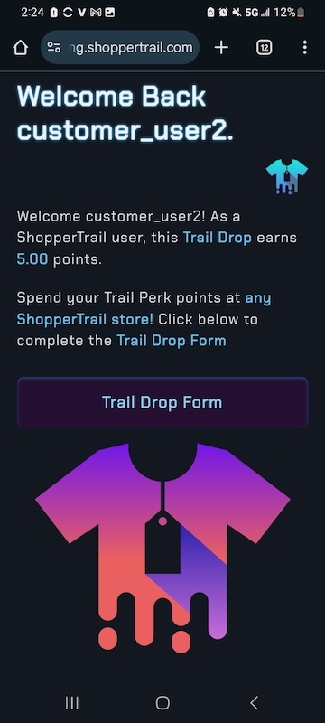

# ShopperTrail UAT

Thanks for helping us test ShopperTrail!

Below is a prioritized instructions list of end‑to‑end test scenarios for UAT which runs in a staging environment (non-permanent data).  Each tester should spend ~30–45 minutes working through core flows (Steps 1–4), then—time permitting—move on to guest accounts and QR‑code manipulation (Steps 5–8).

Email `shoppertrail@gmail.com` or `service@shoppertrail.com` if you have questions regarding these instructions.  

**Note:** While the steps below cover our core flows, please feel free to deviate and explore the app freely if you'd like. To assess if the app is intuitive to you.

---

## Table of Contents

1. [Quick Overview](#shoppertrail-quick-overview)  
2. [Prerequisites](#prerequisites)  
3. [Instructions](#instructions)  
4. [Scenario ID List](#scenario-id-list)  
   1. [ID 1: Homepage Load & Visual Check](#id-1-homepage-load--visual-check)  
   2. [ID 2: About Page Content & Media](#id-2-about-shoppertrail-page-content--media)  
   3. [ID 3: Login & Logout (Seeded Account)](#id-3-login--logout-seeded-account)
   4. [ID 4: Social Single Sign-On (Google & Twitter)](#id-4-social-single-signon-google--twitter)
   5. [ID 5: Trail Drop as Guest](#id-5-trail-drop-as-guest)  
   6. [ID 6: …](#id-6)  
   7. [ID 7: …](#id-7)  
   8. [ID 8: …](#id-8)  

---

## ShopperTrail Quick Overview

ShopperTrail is a data platform for local brick-and-mortar retail businesses. Store customers provide feedback as to why they walked out without buying an item (i.e. wrong size/brand), OR if an item was purchased, feedback as to how satisfied they were.  

There is no purchase necessary. In exchange for this feedback ("Trail Drops" in the ShopperTrail world), users are granted points that can be spent in *any* ShopperTrail partner store on discounts/rewards.  

Stores using ShopperTrail obtain on-demand direct *private* feedback from customers. ShopperTrail is a feedback platform providing critical insights from in-store shoppers which can be used for merchandising and inventory management decisions. 

ShopperTrail (brief) informational landing page: <a href="https://shoppertrail.com" target="_blank" rel="noopener"><i>ShopperTrail</i></a>

---

## Prerequisites

- A desktop/laptop and a mobile device in the same room.  
  - So that you can reference / scan QR codes 
- A printed or on‑screen **Store QR Code** for the test store (provided in this doc).  
- Test user credentials (seeded in staging) i.e.:  
  - Username: `customer_user2`  
  - Password: `HelloWorldForever!1`  
- Optional: Google or Twitter account for social‑login. 
    - **NOTE** Staging data is deleted *frequently!* <mark>Your email / social sign-in credentials will **NEVER** be shared.</mark>
- Access to your email on your mobile or desktop, to confirm registration / guest‑QR emails.

---

## Instructions

Perform the actions in the below test scenarios and record your results. One **Scenario ID** = one row in the <a href="https://docs.google.com/spreadsheets/d/1IySh1x6vaiKN3oshc-UBUz5yDCohQTiPNfdR_DzeB7U/edit?usp=sharing" target="_blank" rel="noopener">Google Sheets "UAT-Data" document</a> which you can fill out as you go.  

UAT-Data Google Sheet:  

 

Scenario IDs 1 - 8 correspond to the **Scenario ID List** below. 

### Screenshots

Screenshots are appreciated so that we can understand what you are or are not seeing on your particular device/browser. Do colors/fonts seem off? Is the ShopperTrail copy not clear? Did you encounter an error?  
  - Screenshots can be uploaded to <a href="https://drive.google.com/drive/folders/1IzFfxT1jxnsi00PgxqbIxyPiDnhVURZw?usp=sharing" target="_blank" rel="noopener">this Google Drive folder.</a> 
  - Once uploaded hover over the screenshot and click the share icon.
  - Make sure "Anyone with the link" is selected under "General Access." 
  - Click "Copy link." 
  - Paste the screenshot link into the appropriate Scenario ID row you're testing in the "UAT-Data" Google Sheet.

---

## Scenario ID List  

### ID 1. Homepage Load & Visual Check

<strong>Expand / Collapse</strong>

1. **Scenario ID 1:** Navigate to `https://staging.shoppertrail.com` (note browser)  
2. **Verify:**
   - Branding (logo, fonts, colors) matches the provided screenshots.
   - Homepage TOP - Main page - logo should fade in and out in front of a background image.  

     
   
   - Homepage scrolled down - Main page as user scrolls - Should have buttons
     1. Login / Register
     2. Scan a ShopperTrail QR
     3. About
   - Should include a link for retailer sign-up info (for "Store" users)
   - Should include ShopperTrail Overview Video  

   

   - Main video loads and plays (click cover gif or link). Loading timer emoji displayes with font.
   - Clicking the ShopperTrail small T-Shirt logo will always return to the main homepage, or if the user's logged in, return to user's dashboard.
   - All primary navigation links (Login/Register, Scan a ShopperTrail QR, About) are clickable and lead to the correct pages.
   - On your phone, click the *Scan a ShopperTrail QR* there should be options to show "quick" or "advanced" scanner.
     - Click to show quick scanner and grant browser camera permissions. Ensure ShopperTrail scanner pops up. Hide scanner and exit for now.
3. **Expected:** Page renders cleanly in less than 2 seconds, video playback starts without error, links navigate correctly. ShopperTrail scanner appears.
   - *Note* ShopperTrail scanner will only scan ShopperTrail QR Codes, this is so people can't create fakes.
   - Try to scan a random QR code on the internet if you'd like, this should not work. 

---

### ID 2. About ShopperTrail Page Content & Media

<strong>Expand / Collapse</strong>

1. **Scenario ID 2:** Click **About** in the main menu.  
2. **Verify:**  
   - Modal (pop up box) shows informing the user that all information is in one place.
   - Now navigate *back* to the homepage and again to the *About* page. The modal should now not* appear.
   - Two main sections are available “For Customers” and “For Store Partners”
     - Clicking one main section should change the table of contents to reflect the proper main section
   - Click and scroll through a few sub-sections of the table of contents to make sure there are no glitches. No need to read everything.
   - Click a sub-section with a video thumbnail (camcorder emoji). Ensure video plays on click. No need to view all.
3. **Expected:** Content is present and legible; video playback initiates on tap/click.

---

### ID 3. Login & Logout (Seeded Account)

<strong>Expand / Collapse</strong>

1. **Scenario ID 3:** Navigate to **Login / Register**, enter pre-seeded credentials.  
   - Username: `customer_user2`  
   - Password: `HelloWorldForever!1`  
2. Using the top menu Click "Account" > "Edit Profile" and change values of `How often do you shop in stores?` or `Zip` to a new selection or value.
   - *Please DO NOT* change username or email.
   - *Please DO NOT* delete account or change password.
3. Click "My Stores and Points" towards the bottom, click "ABC Store" 
4. **Verify:**  
   - Successful login redirects to the user dashboard. Note, clicking the t-shirt logo brings you back to the dashboard now.
   - There should be at least 10 points in this account
   - Account changes took place (step 2), verify this by clicking "Edit Profile" again
   - Verify the details for "ABC Store" come up when clicked (step 3)
   - **Account > Logout** correctly ends the session and shows a logout page. Click back to the homepage by clicking the T-Shirt logo.  
5. **Expected:** Login/logout and basic dashboard and store info render properly. Account > Edit Profile flow works.

---

### ID 4. Social Single Sign‑On (Google & Twitter)

<strong>Expand / Collapse</strong>

1. **Scenario ID 4:** Navigate to **Login / Register**, choose **Google Sign-in** or **X-Twitter Sign-in**.
   - If you are already logged in with Google or Twitter, you may not need to verify your social account
   - Reminder:
     - Your single sign-on email is *not* retained, it is in a `staging` environment where data gets deleted frequently.
     - You are also <mark>free to delete your account manually at anytime</mark> via "Account" > "Delete Account"
2. Since single sign-on is used, ShopperTrail asks 2 additional questions to register a user profile.
   - How frequently you shop in physical stores
   - Your zip code
3. Click "Account" > "Edit Profile" change your `username` or `How often do you shop in stores?` or `Zip`
4. Click "Account" > "Edit Profile" change your email *if* you have another email address you can use/verify.
5. **Verify:**  
    - OAuth popup works and allows you to complete authentication via Google or Twitter/X verification, if you're not already logged in (step 1).
    - After answering (step 2) questions, verify that you are signed in to ShopperTrail by clicking on the *ShopperTrail app dashboard* link. You can also click the t-shirt logo.
      - You should see a message that indicates your username and that it can be changed if you wish.
      - You should see a pop-up that says something like "As a member, you increased your Trail Drop submission limit..." 
        - Log out and log in a few times, verify that this pop-up no loger appears.
    - Verify Upon first log-in there should be a pop-up message that explains increased rewards of an account.
      - Log out and log back in again this pop-up should not appear again. 
    - Verify (step 3) took place by clicking again "Account" > "Edit Profile"
    - Verify (step 4) if you completed this. Log-in again with single sign-on and check "Account" > "Edit Profile" 
6. **Expected:** Social login completes, account is created, and session persists. 
   - Delete your account if you wish. You can re-test if you'd like. 

---

### ID 5. Trail Drop as Guest

<strong>Expand / Collapse</strong>

1. **Scenario ID 5:**  This scenario tests the core ShopperTrail feedback feature for *Guests.*  

    Leaving feedback (called a "Trail Drop") for a store, typically constitutes why a shopper left without buying an item (wrong style/brand). Although feedback can also be that they were happy to find/purchase an item in-stock. Providing feedback as a guest does not require a ShopperTrail account. 
   - On your mobile device, open the camera (or our QR‑scanner app) and scan the **Store QR Code** below. Note, in the real world this may be at the store's counter or posted inside the door. 
   

      
   

   **Click “Trail Drop Form”** to begin filling out the form. Which should look like the below.
   
     
   
   Simply invent a scenario where you did not (or did) find what you were looking for, and why you did not make a purchase (or, if you did purchase, how satisfied were you). After the form is submitted, you should arrive at the Trail Perk screen (below) this tells you of your earned points. 
   
     
   
   Add an email address to which to send your earned points - Trail Perk QR code
2. **Verify:**  
   - A confirmation screen appears. You've just earned ShopperTrail points without having an account. The points are in the QR Code. 
   - Check that the copy makes sense, you can copy / save the token, take a screenshot or email your QR code to yourself (or anywhere). 
   - Detailed Guest Guide is available on this screen too as a refresher of the process. 
   - No account is required.  
   - Check email, ShopperTrail Trail Perk should have arrived in your inbox (spam/updates/promotions)
3. **Repeat:** Scan again, choose another scenario, if you did not make a purchase last time maybe you select that you did make a purchase this time. Rate satisfaction, etc. Submit.  
4. **Expected:** Both submissions succeed, guest QR redemption code is displayed or emailed.

---

### ID 6. Trail Drop as Registered User

1. **Scenario ID 6:** Log in with your ShopperTrail user.  
   - You may use your ShopperTrail account created via Social Sign-On (ID 4) i.e. Google or the seeded account, which is:
      - Username: `customer_user2`  
      - Password: `HelloWorldForever!1` 
2. **Step:** Scan the **Store QR Code** (provided again below) and submit a Trail Drop (purchase or no‑purchase).  
   

      
   

   <strong>Screen Should Appear As Below</strong>  

     

3. **Verify:**  
   - Submission is recorded to your account (check **Dashboard**).
   - You should get more points for a logged in submission i.e. if Guest points were 3.5, then as a logged-in user you should get 5 points. 
   - After a successful submission, screen should look like the below.  

     
  
4. **Expected:** Form loads, submission is tied to your user profile.

---

### ID 7. New‑User Registration & Trail Drop

1. **Scenario ID 7:** From the homepage, click **Sign Up**, fill out username/password/email, then log in.  
2. **Step:** Scan the **Store QR Code**, submit a Trail Drop.  
3. **Verify:**  
   - Account creation email (if any) arrives.  
   - After email activation (if required), you can log in.  
   - Trail Drop submission appears under **My Activity**.  
4. **Expected:** Flow “Sign Up → Activate → Submit” completes end‑to‑end.

---

### ID 8. Guest‑QR Redemption to Registered Account

1. **Scenario ID 8:** On your mobile, scan one of the **Guest QR Codes** generated in Step 5.  
2. **Verify:**  
   - You’re prompted to log in (if not already).  
   - Upon login, points from the guest code are credited to your account balance.  
   - Attempting to redeem the same guest code again should be disallowed.  
3. **Expected:** Points credit succeeds once, further attempts yield an error message.

---

### Notes & Next Steps

- **Priority 1:** Steps 1–4 (core site flow, login, content, social SSO).  
- **Priority 2:** Steps 5–6 (guest & registered Trail Drops).  
- **Priority 3:** Steps 7–8 (new sign‑up + guest QR redemption).  
- After completing these, please capture any screenshots, error messages, or suggestions; note the device/browser used.
- If you discover missing data (e.g. no subscription tiers displayed), record the exact page URL and console/network errors.

Happy testing! 🎉  
